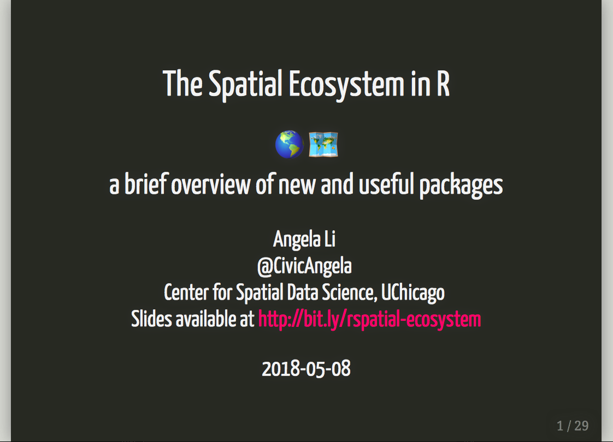

# The Spatial Data Ecosystem in R 🌎

I gave a talk to my fellow researchers at the [Center for Spatial Data Science](https://spatial.uchicago.edu/) on May 8, 2018 about the new `sf` package, and my sense of the evolving spatial data ecosystem in R. Here are the slides from the talk!

**I am currently starting work on a project for the Center for Spatial Data Science that aims to put together an introductory website for those starting to learn spatial analysis. I would love to hear from you what types of resources would be helpful in your day-to-day work, and what types of problems you hope to solve with spatial analysis. See below for my contact info.** 

Get in contact
=================
Find me on Twitter at [@CivicAngela](https://twitter.com/CivicAngela) or at ali6 [at] uchicago.edu with your thoughts! And let me know if you want to collaborate on this website.

I'm also building out the #rspatialladies community! If you identify as female/non-binary, please join our Slack channel [at this link](https://join.slack.com/t/r-spatialladies/shared_invite/enQtMzU1MTIwMjU2NzUyLTBkZjU1NDFiZGU3YzNmN2Y0Y2NiYTM2Njk2ZjI5M2IyMTNiNjI3ZDQ4MzEyMjQxNjM2YWU2ZGVkZWRiYmU1ZDM), and invite women you think would be interested.
