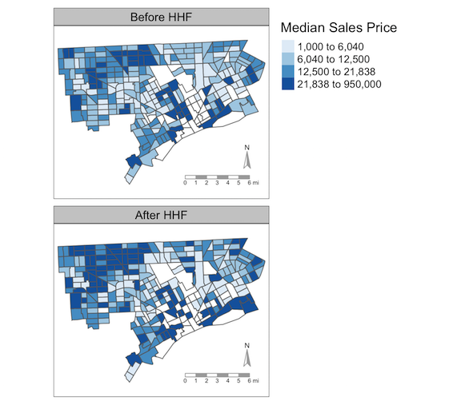
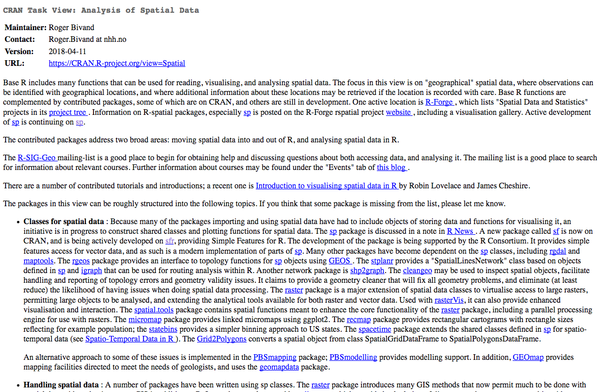
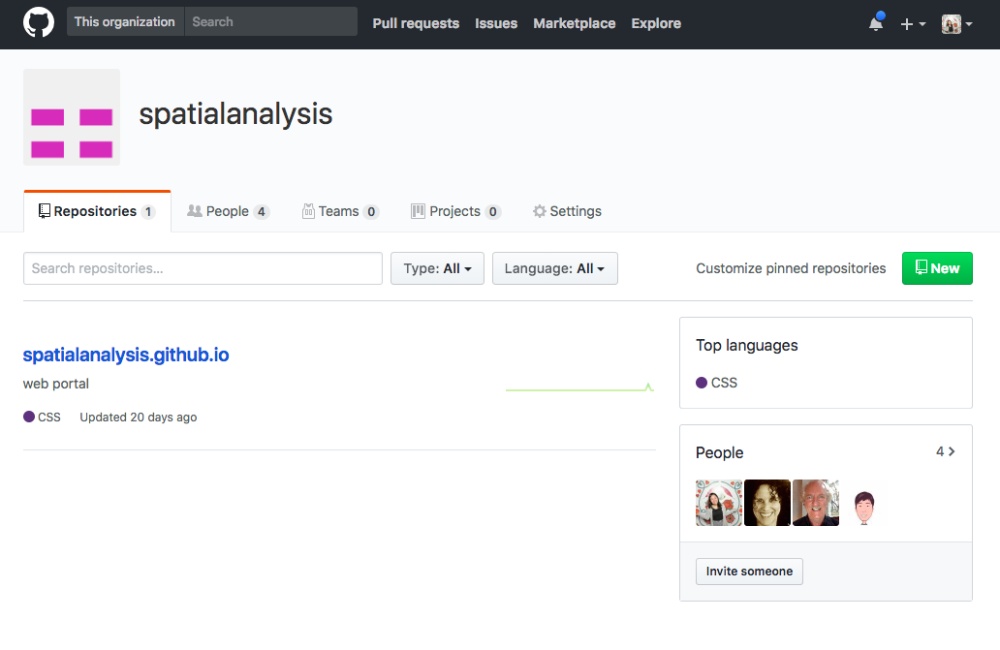
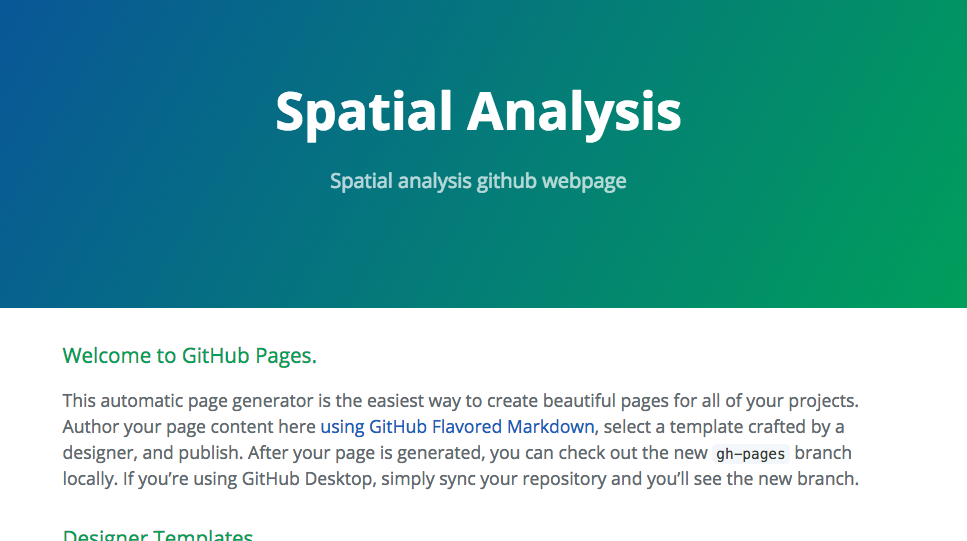

```{r setup, include=FALSE}
options(htmltools.dir.version = FALSE)
library(spData)
library(sf)
elect80_sf <- st_as_sf(elect80)
```

# Goals of this talk:

## 1. Showcase new spatial packages in R (`sf`!)

## 2. Demonstrate how to do tidy spatial analysis

## 3. Discuss future ways to build out the #rspatial ecosystem

---

class: inverse, center, middle

# My thesis gave me an excuse to try cutting-edge spatial packages

---

# A map from my thesis



---

# And the code used to produce it

```{r eval=FALSE, tidy=FALSE}
# Load packages
library(tidyverse)
library(sf)
library(tmap)

# Read in data
sales <- read_csv("output/sales-tidy.csv")
tracts <- st_read("data/orig/shapefiles/detroit_tracts.shp")
tracts <- rename(tracts, tract = GEOID)

# Join csv to shapefile
sales <- sales %>% 
  right_join(tracts, ., by = "tract") 

# Make map
med_sales_map <- tm_shape(sales, unit = "mi") +
  tm_fill("med_price", palette = "Blues", breaks = quantile(a$med_price), title = "Median Sales Price") +
  tm_facets("after_hhf") +
  tm_shape(tracts) + 
  tm_borders() +
  tm_compass(fontsize = 0.6, color.dark = "dark grey") +
  tm_scale_bar(color.dark = "dark grey")

save_tmap(med_sales_map, "doc/figs/med_sales_map.png")
```

---

class: center, middle

# Note the use of `sf`

(What I'll be discussing today)


---

class: inverse, center, middle

# The `sf` package revolutionizes how R stores spatial data

---

class: inverse, center, middle

# (`sf` stands for "simple features")

--

### It's based off of PostGIS!

---

# Previously, R had `sp` spatial classes

```{r message=F, warning=F}
str(elect80) # Data is from spData package - 1980 elections by county
```

---

# Now, R has TIDY `sf` spatial classes

```{r warning=F}
str(elect80_sf)
```
---

# The difference?

```{r warning=F}
class(elect80)
class(elect80_sf)
```

---

# `sf` objects are `data.frame`s!

```{r warning=F}
head(elect80_sf)
```

---

# Which means...

You can perform analysis on the `sf` object itself!

```{r message=F, warning=F}
library(dplyr)

# Which counties had over 50% turnout? 
turnout_over_half <- filter(elect80_sf, pc_turnout > 0.5)
plot(st_geometry(turnout_over_half))
```

---

```{r message=F, warning=F}
# Which counties had under 50% turnout?
turnout_under_half <- filter(elect80_sf, pc_turnout < 0.5)
plot(st_geometry(turnout_under_half))
```

---

# Read/write is simple
```{r message=F, warning=F}
# Read in shapefile of Chicago health data (from GeoDa site)
chi <- st_read("data/ComArea_ACS14_f.shp")
```

--

```{r }
# Calculate new attribute, population density
chi2 <- mutate(chi, Pop2014Density = Pop2014/shape_area)
```

--

```{r }
# Write new shapefile
st_write(chi2, "data/chicago_high_pop.shp", delete_layer = T)
```

---

# There are also a bunch of wonderful commands wrapped into `sf`...

- `st_transform()`, `st_crs()`
- `st_centroid()`, `st_bbox()`, `st_convex_hull()`
- `st_area()`, `st_length()`, `st_distance()`
- `st_buffer()`, `st_intersection()`, `st_contains()`, `st_union()`
- `st_join()`

And more! The [function reference in the documentation](https://r-spatial.github.io/sf/reference/index.html) has it all.

---

# Packages that support `sf`- tmap

```{r warning=F}
library(tmap)
tm_shape(world) +
  tm_polygons("pop") + 
  tm_style_cobalt()
```

---

# Packages that support `sf` - leaflet

```{r warning=F}
library(leaflet)
leaflet(world) %>% 
  addPolygons(weight = 1,
              fillColor = ~colorQuantile("YlOrRd", pop)(pop),
              highlightOptions = highlightOptions(color = "white", weight = 2, bringToFront = TRUE),
              popup = ~as.character(name_long))
```

---

# Packages that (sort of) support `sf`- ggplot2

```{r message=F, warning=F}
library(ggplot2)
ggplot() +
  geom_sf(data = world)
```

---

class: center, middle

# But many packages still require `sp` objects...

```{r eval=F}
elect80_sp <- as(elect80_sf, "Spatial")
```

---

# A few other key packages to check out

- `tidycensus`: all census and ACS data from past several years, delivered directly into R
- `tigris`: TIGERline shapefiles (boundaries, etc)
- `osmdata`: OpenStreetMap data, delivered directly into R
- `spData`: sample spatial datasets to play around with in all sorts of formats
- `raster`: many functions for working with raster data
- `opencage`: geocoding
- `shiny`: the workhorse for R interactive webapps

---

# Resources to get you started

- Jakub Nowosad's [great slides on GIS with R](https://cdn.rawgit.com/Nowosad/gis_with_r_how_to_start/aea08f46/gis_with_r_start.html), off of which these slides are largely based
- [Geocomputation with R](https://geocompr.robinlovelace.net/), an open-source spatial analysis textbook currently under development, and the best resource for this new `sf` stuff 
- [sf documentation](https://r-spatial.github.io/sf/) by Edzer Pebesma
- A great [Datacamp intro course](https://www.datacamp.com/courses/spatial-analysis-in-r-with-sf-and-raster) on sf by Zev Ross (the first part is free)

---

class: inverse, center, middle

# What needs to be done to improve the #rspatial package ecosystem?

---

# A few ideas...

- More support for *tidy* spatial analysis
- Better documentation on existing spatial packages
    - More tutorials and resources for all #rspatial packages
- **Clear entry point to spatial analysis for beginners**

--



---

class: inverse, center, middle

# Which leads to my next project...

---

# Building out a overview/clearinghouse of R for spatial analysis



---

class: inverse

# Goal is to have a beginner-friendly website



---

class: center, middle

# What would you find useful on this website? 

What types of resources would you like to see on this site?

What would help you do your research better?

**Contact me at @[CivicAngela](https://twitter.com/CivicAngela)**

---

class: center, middle

# Thanks!

Slides created via the R package [xaringan](https://github.com/yihui/xaringan) by [Yihui Xie](https://twitter.com/xieyihui?lang=en).

Slides available at  <font style="text-transform: lowercase;"><http://bit.ly/rspatial-ecosystem></font> <br>

Source code for these slides can be found on [my Github](https://github.com/angela-li/rspatial-ecosystem).